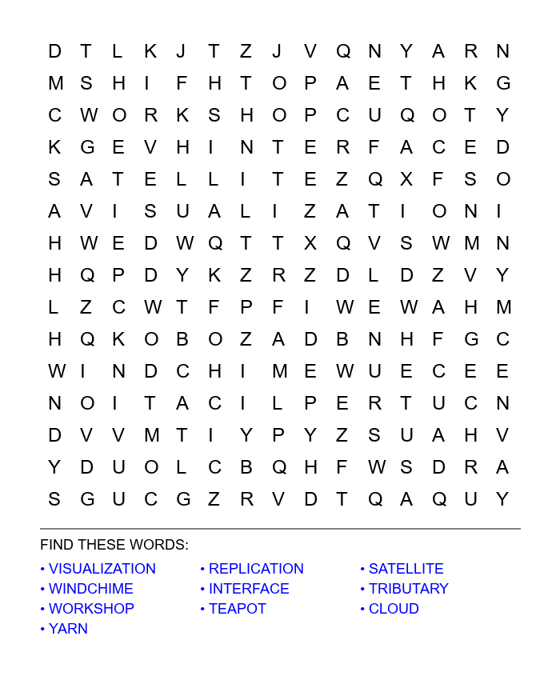

# 🧩 Word Search Puzzle Generator

A **Python-based word search puzzle generator** built using **Object-Oriented Programming (OOP)** principles.
The program generates a random word search grid, places words in multiple directions, fills remaining cells with random letters, and exports the puzzle as a **PNG image** with a neatly formatted word list.
---


<p align="center">
  
</p>

## ✨ Features

* 📐 Customizable grid size
* 🔤 Random word placement (8 directions supported)
* 🧠 Smart placement logic (overlapping letters allowed when valid)
* 🧩 Random filler letters for unused cells
* 🖼️ Exports puzzle as a **PNG image**
* 🧾 Automatically displays the word list below the grid
* 🕵️ Optional *cheat mode* (places words in lowercase)
* 📜 Logging of generation attempts
* 🧱 Clean OOP-based architecture

---

## 🧭 Supported Word Directions

Words can be placed in **all major directions**:

* Left → Right
* Right → Left
* Top → Bottom
* Bottom → Top
* Diagonals (↘ ↙ ↗ ↖)

---

## 📦 Project Structure

```
.
├── word_search_oop2.py   # Main program
├── words.txt             # Optional custom word list
├── word_search.png       # Generated puzzle image
├── log.txt               # Generation log
└── README.md
```

---

## 🚀 Getting Started

### 1️⃣ Clone the Repository

```bash
git clone https://github.com/your-username/word-search-generator.git
cd word-search-generator
```

### 2️⃣ Install Dependencies

This project uses **Pillow** for image generation:

```bash
pip install pillow
```

---

## ▶️ Usage

Run the script directly:

```bash
python word_search_oop2.py
```

By default, it will:

* Generate a **15×15 grid**
* Place **10 words**
* Display the grid in the console
* Save the puzzle as `word_search.png`

---

## ⚙️ Customization

You can customize the generator by modifying the constructor:

```python
word_search = WordSearchGrid(
    n_words=10,
    grid_size=15,
    words_file='words.txt',
    cheat=False
)
```

### Parameters

| Parameter    | Description                                 |
| ------------ | ------------------------------------------- |
| `n_words`    | Number of words to place                    |
| `grid_size`  | Size of the grid (NxN)                      |
| `words_file` | File containing words (one per line)        |
| `cheat`      | If `True`, placed words appear in lowercase |

---

## 📝 Word List

* Provide your own `words.txt`
* One word per line
* Words are automatically converted to uppercase
* If no file is found, a default word set is used

---

## 🖼️ Output Example

* Grid letters are evenly spaced
* Word list is wrapped into columns
* Separator line clearly distinguishes grid and words
* Clean, printable layout

---

## 🧠 Design Notes

* Uses **OOP for clarity and scalability**
* Word placement prioritizes **longer words first**
* Overlapping letters are allowed if they match
* Fallback fonts are used if system fonts are unavailable

---

## 📚 Dependencies

* Python 3.x
* Pillow (`PIL`)

---

## 👨‍💻 Author

**Michael Aheebwa**

Python • Algorithms • Educational Tools

---

## 📜 License

This project is released under the **MIT License**.
You are free to use, modify, and distribute it.

---
